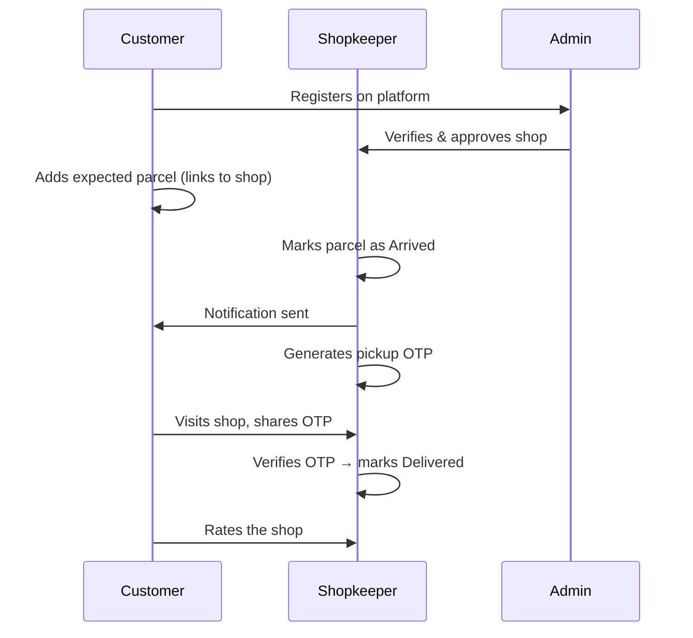
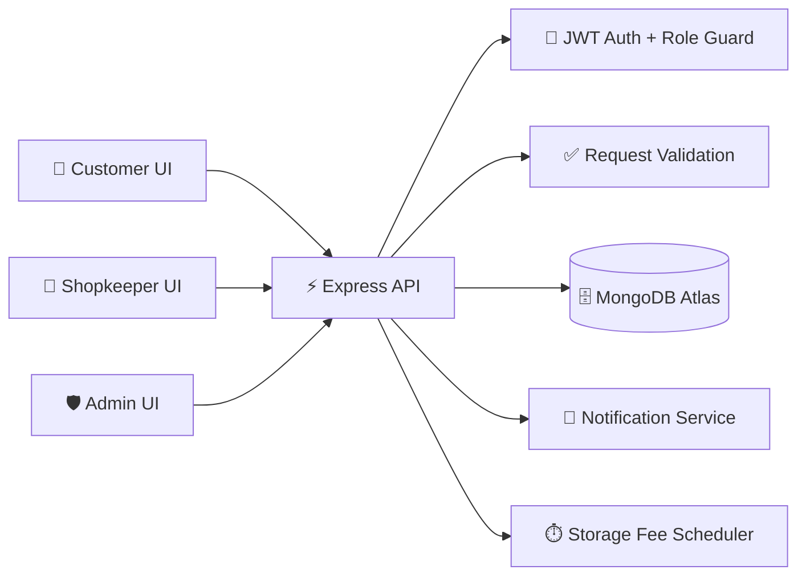
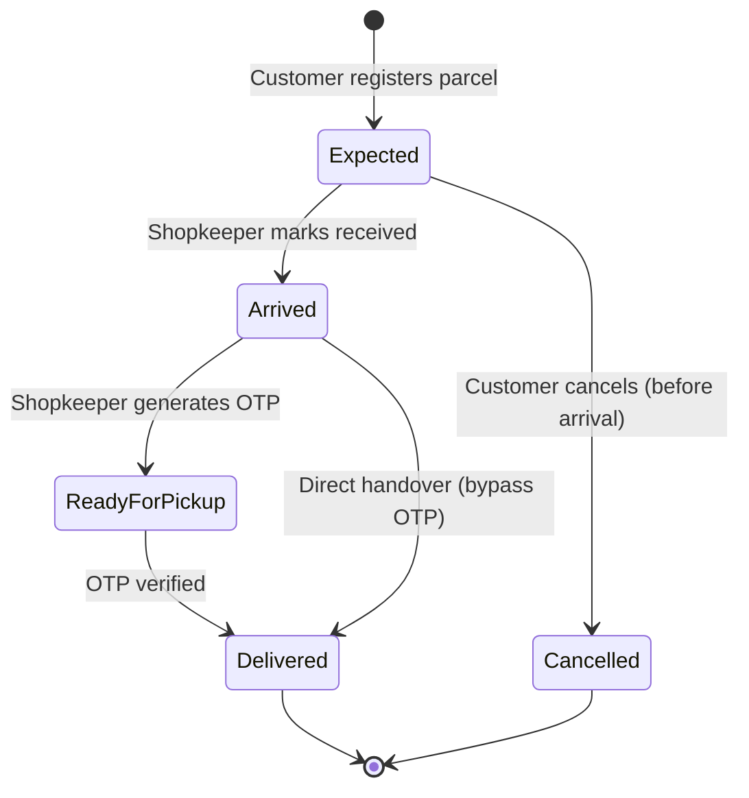
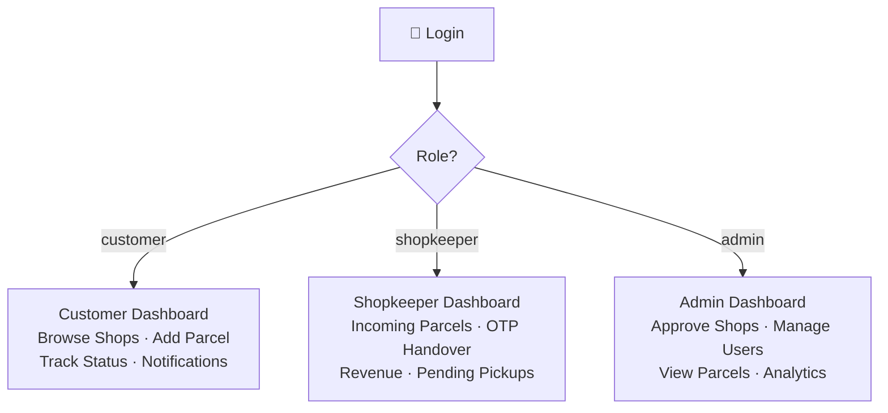
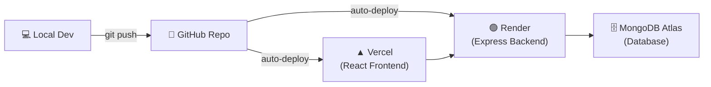

# GramPickup 📦

> A village-first parcel pickup network — bridging the last-mile delivery gap for semi-urban and rural India.

Instead of waiting for failed doorstep deliveries or travelling to distant courier offices, customers route their online orders to a **nearby verified shop**. Shopkeepers handle storage and use **OTP-based secure handover** when customers come to collect. Admins verify shops and keep the platform in check.

**Live Demo →** [`https://grampickup.vercel.app`](https://grampickup.vercel.app)

---

## How It Works



---

## Architecture



---

## Parcel Lifecycle



---

## Role-Based Access



---

## Features

### 👤 Customer
- Browse verified pickup shops with ratings and location
- Register expected parcels with tracking number and delivery date
- Real-time lifecycle tracking: `Expected → Arrived → Ready for Pickup → Delivered`
- View accrued storage fees as days increase
- Rate shops after successful pickup
- Forgot password via email reset link
- Google OAuth sign-in

### 🏪 Shopkeeper
- Register a shop and await admin approval
- View and filter incoming parcels by status or search
- Mark parcels as **Arrived** and generate pickup OTPs
- Secure OTP-based handover or direct handover override
- Revenue dashboard showing all delivered parcels and earnings

### 🛡️ Admin
- Approve or reject shop registrations
- Manage all users (customers & shopkeepers) — with delete + cascade
- View and filter all parcels platform-wide
- Monthly analytics: parcel volume trends, revenue charts

---

## Tech Stack

| Layer | Technology |
|---|---|
| Frontend | React 19, Vite, React Router v6, Tailwind CSS |
| Backend | Node.js, Express.js |
| Database | MongoDB, Mongoose |
| Auth | JWT (jsonwebtoken), bcryptjs |
| OAuth | Google OAuth 2.0 (`@react-oauth/google`) |
| Email | Nodemailer (Gmail App Password) |
| Security | Helmet, express-rate-limit, CORS allowlist, express-mongo-sanitize |
| Validation | express-validator |
| Testing | Jest, Supertest, MongoDB Memory Server |
| Deployment | Vercel (frontend) + Render (backend) + MongoDB Atlas |

---

## Getting Started

**Prerequisites:** Node.js 20+, MongoDB (local or Atlas)

```bash
# 1. Install all dependencies (root + server + client)
npm run install:all

# 2. Configure environment
cp server/.env.example server/.env
# Edit server/.env — fill in MONGODB_URI, JWT_SECRET, etc.

# 3. Seed the database with demo accounts
npm run seed --prefix server

# 4. Start dev servers (frontend + backend concurrently)
npm run dev
```

- Frontend: `http://localhost:5173`
- Backend: `http://localhost:5001`

### Demo Accounts (after seeding)

| Role | Email | Password |
|---|---|---|
| Admin | *(set via `ADMIN_EMAIL` in `.env`)* | *(set via `ADMIN_PASSWORD` in `.env`)* |
| Customer | `customer1@grampickup.com` | `customer123` |
| Shopkeeper | `shopkeeper1@grampickup.com` | `shopkeeper123` |

---

## Environment Variables

### `server/.env`

```env
NODE_ENV=development
PORT=5001
MONGODB_URI=mongodb+srv://<user>:<pass>@cluster.mongodb.net/grampickup
JWT_SECRET=your-long-random-secret-here
JWT_EXPIRES_IN=30d
CLIENT_ORIGIN=http://localhost:5173
ENABLE_FEE_SCHEDULER=true

# Admin (used by seed.js — keep private)
ADMIN_EMAIL=admin@yourdomain.com
ADMIN_PASSWORD=your-strong-password

# Email — for forgot-password flow (use Gmail App Password)
EMAIL_USER=your-gmail@gmail.com
EMAIL_PASS=your-app-password

# Google OAuth Client ID
VITE_GOOGLE_CLIENT_ID=your-client-id.apps.googleusercontent.com
```

### `client/.env`

```env
VITE_API_URL=http://localhost:5001/api
VITE_GOOGLE_CLIENT_ID=your-client-id.apps.googleusercontent.com
```

---

## API Reference

All routes are prefixed with `/api/<resource>`.

### Auth — `/api/auth`

| Method | Route | Access | Description |
|---|---|---|---|
| `POST` | `/register` | Public | Register customer or shopkeeper |
| `POST` | `/login` | Public | Login, returns JWT |
| `GET` | `/profile` | Private | Get own profile |
| `PUT` | `/profile` | Private | Update name/phone/password |
| `POST` | `/forgot-password` | Public | Send password reset email |
| `PUT` | `/reset-password/:token` | Public | Reset password with token |
| `POST` | `/google` | Public | Google OAuth sign-in |

### Shops — `/api/shops`

| Method | Route | Access | Description |
|---|---|---|---|
| `GET` | `/approved` | Public | List all approved shops |
| `POST` | `/` | Shopkeeper | Register a new shop |
| `GET` | `/mine` | Shopkeeper | Get own shop details |
| `PUT` | `/mine` | Shopkeeper | Update own shop |
| `PUT` | `/:id/status` | Admin | Approve or reject a shop |
| `POST` | `/:id/rate` | Customer | Rate a shop after pickup |

### Parcels — `/api/parcels`

| Method | Route | Access | Description |
|---|---|---|---|
| `POST` | `/` | Customer | Register an expected parcel |
| `GET` | `/my-parcels` | Customer | Get own parcels with fees |
| `PUT` | `/:id/cancel` | Customer | Cancel an expected parcel |
| `GET` | `/incoming` | Shopkeeper | Get shop's incoming parcels |
| `PUT` | `/:id/received` | Shopkeeper | Mark parcel as Arrived |
| `PUT` | `/:id/ready` | Shopkeeper | Generate OTP, mark Ready |
| `PUT` | `/:id/deliver` | Shopkeeper | Verify OTP, mark Delivered |
| `PUT` | `/:id/deliver-direct` | Shopkeeper | Direct handover (no OTP) |
| `GET` | `/revenue` | Shopkeeper | Revenue from delivered parcels |
| `GET` | `/` | Admin | Get all parcels (filterable) |

### Notifications — `/api/notifications`

| Method | Route | Access | Description |
|---|---|---|---|
| `GET` | `/` | Private | Get own notifications |
| `PUT` | `/:id/read` | Private | Mark one as read |
| `PUT` | `/read-all` | Private | Mark all as read |

### Analytics — `/api/analytics`

| Method | Route | Access | Description |
|---|---|---|---|
| `GET` | `/dashboard` | Admin | Summary stats + monthly trends |
| `GET` | `/users` | Admin | List users (filter by role) |
| `DELETE` | `/users/:id` | Admin | Delete user (cascade) |

---

## Testing

```bash
npm test --prefix server
```

Uses an **in-memory MongoDB instance** — no setup needed. Test coverage includes:
- Auth flows (register, login, JWT validation, role guards)
- Shop approval lifecycle
- Full parcel lifecycle (register → arrive → OTP → deliver)
- Fee calculation
- Notification creation
- Analytics endpoints

---

## Deployment

### Recommended Stack



### Steps

1. **Push code** to your GitHub repo
2. **Render** — connect repo, set root to `server/`, start command `node server.js`
3. **Vercel** — connect repo, set root to `client/`, framework Vite

### Production Environment Variables

| Platform | Key | Value |
|---|---|---|
| Render | `NODE_ENV` | `production` |
| Render | `MONGODB_URI` | Atlas connection string |
| Render | `JWT_SECRET` | Strong random secret |
| Render | `CLIENT_ORIGIN` | Your Vercel URL |
| Render | `ENABLE_FEE_SCHEDULER` | `true` |
| Render | `ADMIN_EMAIL` / `ADMIN_PASSWORD` | Your admin credentials |
| Render | `EMAIL_USER` / `EMAIL_PASS` | Gmail + App Password |
| Vercel | `VITE_API_URL` | Your Render backend URL + `/api` |
| Vercel | `VITE_GOOGLE_CLIENT_ID` | Google OAuth Client ID |

> **Important:** Set `ENABLE_FEE_SCHEDULER=false` if you deploy the backend on a serverless platform. The fee scheduler requires a persistent process — use **Render** for the backend.

---

## Project Structure

```
GramPickup/
├── client/                 # React + Vite frontend
│   ├── src/
│   │   ├── components/     # Layout, ErrorBoundary, etc.
│   │   ├── context/        # AuthContext, ToastContext
│   │   ├── pages/
│   │   │   ├── admin/      # Admin dashboard, shops, users, analytics
│   │   │   ├── customer/   # Customer dashboard, parcels, shops
│   │   │   ├── shopkeeper/ # Shopkeeper dashboard, revenue, pickups
│   │   │   └── public/     # Login, Register, Home, About
│   │   └── utils/
│   └── .env
├── server/                 # Express.js backend
│   ├── config/             # MongoDB connection
│   ├── middleware/         # auth.js, validate.js
│   ├── models/             # User, Shop, Parcel, Notification
│   ├── routes/             # auth, shops, parcels, notifications, analytics
│   ├── utils/              # email, fees, feeScheduler, parcelTimeline
│   ├── seed.js             # Database seeder
│   └── .env
└── package.json            # Root scripts (dev, build, seed)
```

---

**Aryan Sharma** · Software Engineering, DTU
